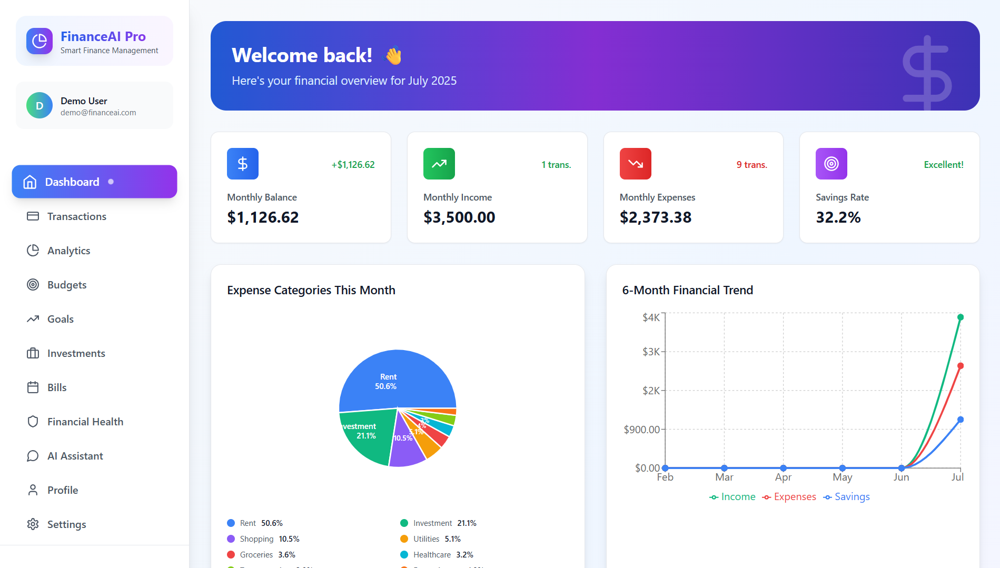

# FinanceAI-Pro 💰

[](https://www.typescriptlang.org/)
[](https://reactjs.org/)
[](https://tailwindcss.com/)
[](https://vitejs.dev/)
[](LICENSE)

> Your personal AI-powered financial advisor and management suite

FinanceAI-Pro is a cutting-edge personal finance management platform that combines the power of artificial intelligence with intuitive financial tracking tools. Take control of your financial future with smart budgeting, intelligent insights, and personalized recommendations.


*Note: Add your application screenshots in the screenshots directory*

## ✨ Features

- **Smart Dashboard**: Comprehensive overview of your financial status with real-time analytics
- **AI-Powered Chatbot**: Get instant financial advice and insights
- **Budget Management**: Create and track budgets across different categories
- **Investment Tracking**: Monitor your investment portfolio and performance
- **Goal Setting**: Set and track financial goals with progress monitoring
- **Bill Management**: Never miss a payment with bill tracking and reminders
- **Transaction Management**: Keep track of your income and expenses
- **Financial Health Score**: Get insights into your overall financial wellbeing
- **Dark/Light Theme**: Comfortable viewing experience with theme options
- **Multi-Currency Support**: Handle transactions in different currencies

## 🚀 Tech Stack

| Category | Technologies |
|----------|-------------|
| Frontend | React 18, TypeScript 5 |
| Styling | Tailwind CSS 3 |
| Build Tool | Vite 4 |
| State Management | React Context |
| API Integration | Custom React Hooks |
| AI Integration | OpenAI GPT-4 |

## 🌟 Key Benefits

- 🎯 **Smart Financial Planning**: AI-driven insights help you make better financial decisions
- 🔒 **Secure & Private**: Your financial data is encrypted and protected
- 📊 **Rich Analytics**: Visual representations of your financial health
- 🤖 **AI Assistant**: 24/7 available financial advisor
- 📱 **Responsive Design**: Works seamlessly on desktop and mobile devices

## 🚀 Getting Started

### Prerequisites

- Node.js (v16 or higher)
- npm or yarn

### Installation

1. Clone the repository:
```bash
git clone https://github.com/KeshavxGupta/FinanceAI-Pro.git
cd FinanceAI-Pro
```

2. Install dependencies:
```bash
npm install
# or
yarn install
```

3. Start the development server:
```bash
npm run dev
# or
yarn dev
```

The application will be available at `http://localhost:5173`

## 🏗️ Project Structure

```bash
src/
├── components/      # Feature-based React components
│   ├── Analytics/  # Financial analytics components
│   ├── Auth/       # Authentication related components
│   ├── Dashboard/  # Main dashboard components
│   └── ...         # Other feature components
├── contexts/       # React context providers
├── hooks/         # Custom React hooks
├── services/      # API and service integrations
└── types/         # TypeScript type definitions
```

## 📱 Features in Detail

### Dashboard
- Real-time financial overview
- Recent transactions
- Quick statistics and insights

### Budgets
- Create and manage budget categories
- Track spending against budgets
- Visual progress indicators

### Investments
- Portfolio tracking
- Investment performance metrics
- Add and manage different investment types

### Goals
- Set financial goals with deadlines
- Track progress towards goals
- Smart recommendations for goal achievement

### Bills
- Bill payment tracking
- Due date reminders
- Payment history

### AI Assistant
- Financial advice
- Spending insights
- Budget recommendations

### Financial Health
- Overall financial score
- Health indicators
- Improvement recommendations

## 🤝 Contributing

We welcome contributions to FinanceAI-Pro! Here's how you can help:

1. Fork the Project
2. Create your Feature Branch (`git checkout -b feature/AmazingFeature`)
3. Commit your Changes (`git commit -m 'Add some AmazingFeature'`)
4. Push to the Branch (`git push origin feature/AmazingFeature`)
5. Open a Pull Request

## 📄 License

This project is licensed under the MIT License - see the [LICENSE](LICENSE) file for details.

## 📬 Contact & Support

<p align="left">
  <a href="https://github.com/KeshavxGupta">
    
  </a>
  <a href="https://x.com/Keshav463387401?s=09">
    
  </a>
  <a href="www.linkedin.com/in/keshav-gupta-751925324">
    
  </a>
</p>

- 👨‍💻 **Developer**: Keshav Gupta
- 🌐 **Project Link**: [FinanceAI-Pro](https://github.com/KeshavxGupta/FinanceAI-Pro)
- 📧 **Report Issues**: [Issue Tracker](https://github.com/KeshavxGupta/FinanceAI-Pro/issues)

---

<p align="center">
  Made with ❤️ by Keshav Gupta
</p>
